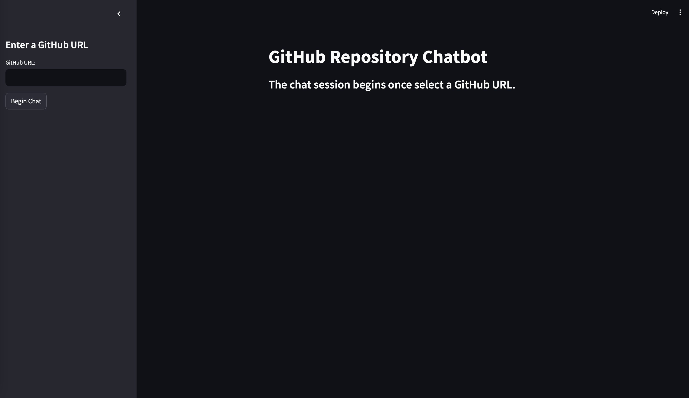
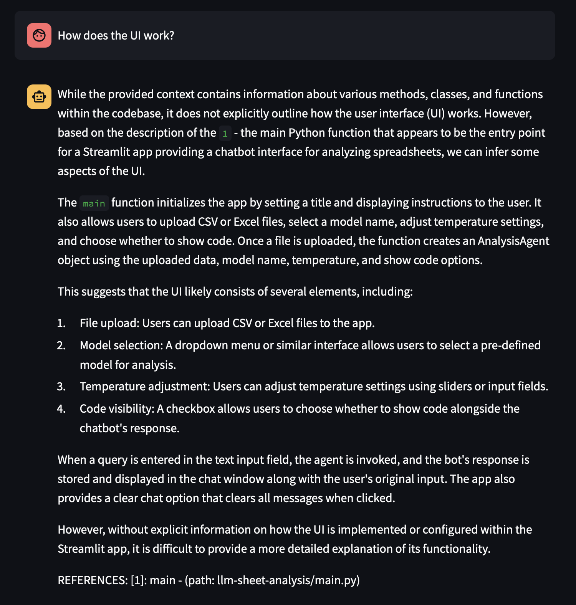
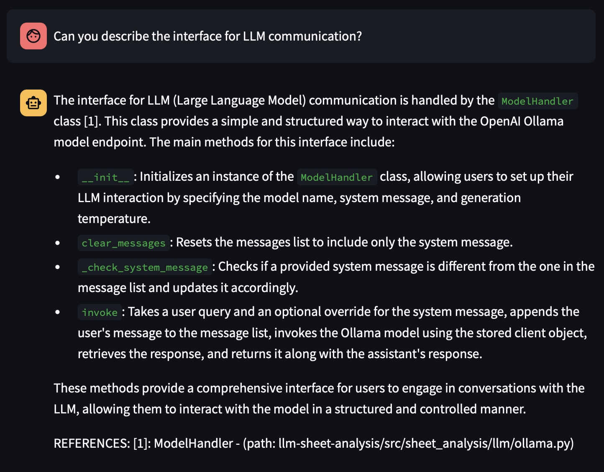

# codebase-analysis
Tool to analyze codebases using PostgreSQL, embedding models, and LLMs. README will be completed when full basic functionality is complete.

## Current state

Current functionality includes:

- LLM communication
- Embedding model communication
- PostreSQL DB utils
- Full repo conversion into DB
- Code summarization
- Summary embedding
- Vector-based retrieval
- LLM question answering
- In-text citations
- Streamlit app

## To Do

Still waiting to be completed:

- Full documentation

