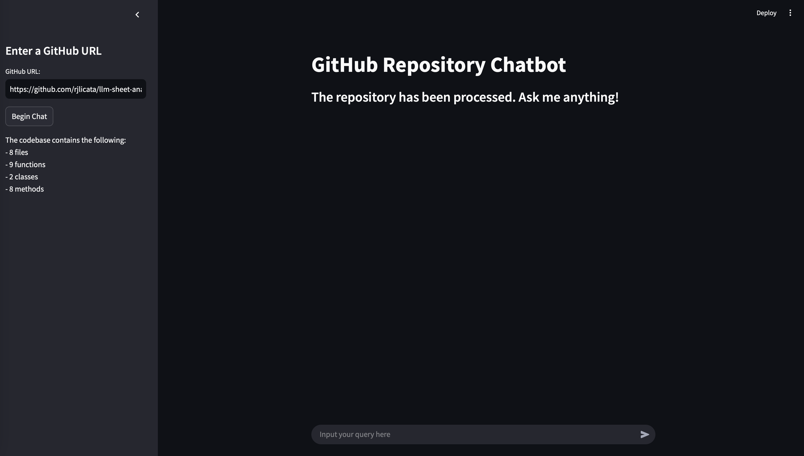

# Codebase Analysis

Contained in this repository is a tool to analyze codebases using PostgreSQL, embedding models, and LLMs. 

## Getting Started

To begin, run the following:

```
git clone https://github.com/rjlicata/codebase-analysis.git
cd codebase-analysis
```

This will download/clone the repository and change directories into it. Prior to starting the app, there are two things that you need to do. First, we need to create a docker network for the PostgreSQL database since Streamlit interferes with the local network. Then, we will start our database instance. Before you run these, see the [PostgreSQL section](#postgresql) of the README.

```
make network
make postgres
```

At any point, you can enter into a SQL session to investigate your database by running `make enter_psql`. This will just get inside the PostgreSQL container and allow you to query it.

### Models

At this point, you are almost ready to run your app. You first need to ensure you have local models for an LLM and a text embedding model. In testing of this repo, I used Ollama as a quick and easy way to host both models. Follow [these instructions](https://medium.com/@sridevi17j/step-by-step-guide-setting-up-and-running-ollama-in-windows-macos-linux-a00f21164bf3) for getting set up with Ollama. With Ollama, you can use models like "llama3.2" and "bge-large" for your LLM and embedding model, respectively. Once they are pulled, you're good to go. Just make sure you update the [base config](data/base_config.yml) to point to the correct endpoint and model name for the LLM and embedding model.

Note: you can also use HuggingFace TGI or vLLM to host your models. Again, just be sure to update the config accordingly.

### PostgreSQL

You will need PostgreSQL and pgvector installed on your computer for the app to actually work. Follow [these instructions](https://dev.to/farez/installing-postgresql-pgvector-on-debian-fcf) to do so if you don't have them. Note: those instructions are for Debian, so make sure to use appropriate directions for your OS.

## Using the App

To start the app, run `make app`. Once you do, the image will build, and the streamlit app will start. Click on the "localhost" link in the console to open the app in your browser. The base UI looks like this:


You need to enter the GitHub URL of the repository you want to query in the sidebar and press "Begin Chat". In the top-right corner, you will see it running as it: downloads the repo, breaks down the Python files, summarizes the components, vectorizes the summaries, and populates the database. Once it is ready, the UI will look like this:



You can see the text change on the main section, the chat bar appeared, and there is a file breakdown in the sidebar. You are ready to ask questions about the repo!

### Examples

I tested this with one of my other repos: [LLM Sheet Analysis](https://github.com/rjlicata/llm-sheet-analysis) and have some samples below. The repo is for another Streamlit app to allow a user to ask questions about spreadsheet data using a code-writing LLM agent. My first question was about the UI component.


When I asked the question, it was vectorized and the top 5 results were retrieved from the PostgreSQL database. They were then fed back to the LLM for it to answer the question. You can see that it cited the functions that it used to get the information.

My next question was about the LLM used for that repo.


Here, it's a similar result. It used a class to answer the question and even described the various methods.

## Notes

First and foremost, it can take a long time to process the repository. The example I used only took just under a minute. However, if you enter a repo that has a lot of code, it can take much longer. I was also using a small LLM and reasonably sized embedding model. If you use larger models, it will take longer. Every function, class, and method is summarized and vectorized, so the longer that takes, the longer the processing will be.

Next, remember that LLMs are imperfect. This is a fun tool to play around with. However, be aware that LLMs can (and do) hallucinate sometimes, so use the citations to verify information in the responses.

Also note that this is not a final product, but a project I'm working on for fun. There are many way that can be improved. See the next section for a list of functionality that is in the current iteration of this repo.

### Current state

Current functionality includes:

- LLM communication
- Embedding model communication
- PostreSQL DB utils
- Full repo conversion into DB
- Code summarization
- Summary embedding
- Vector-based retrieval
- LLM question answering
- In-text citations
- Streamlit app
